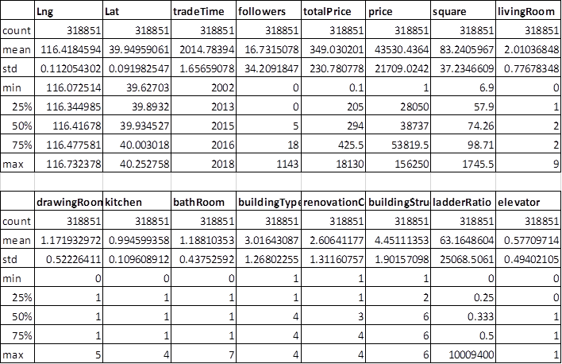
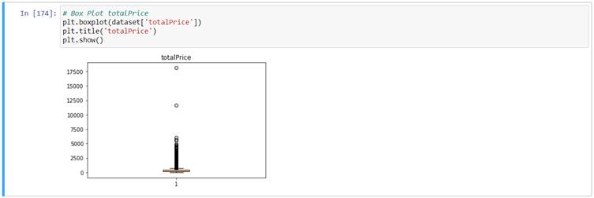
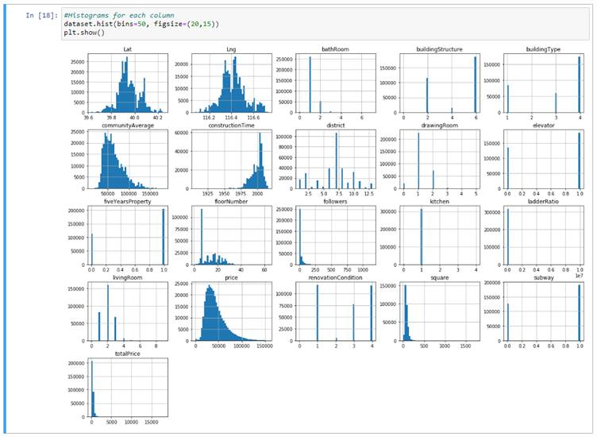
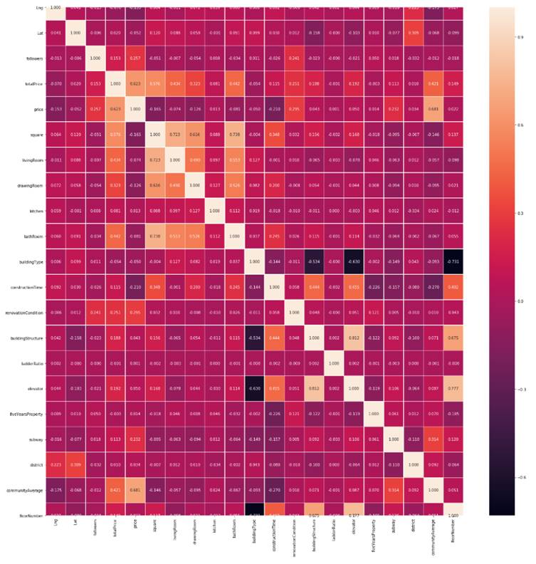
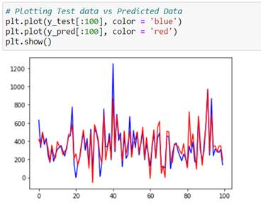
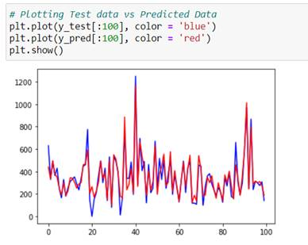
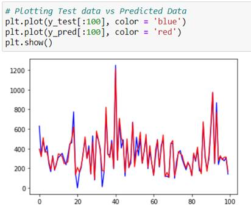

<h1 align="center">
Regression - Machine Learning Algorithm
</h1>

<h2 align="center">
Property Price Prediction
</h2>

![lang]https://img.shields.io/badge/python-v3.7-blue
![lang]https://img.shields.io/badge/Tech-scikit--learn-orange

## Background
The dataset contains the property information of Beijing, China for the period of 2011 to 2017. It includes URL, ID, Lng, Lat, CommunityID, TradeTime, DOM(days on market), Followers, Total price, Price, Square, Living Room, number of Drawing room, Kitchen and Bathroom, Building Type, Construction time, renovation condition, building structure, Ladder ratio(which is the proportion between number of residents on the same floor and number of elevator of ladder. It describes how many ladders a resident has on average), elevator, Property rights for five years（It's related to China's restricted purchase of houses policy), Subway, District, Community average price. Most of the data were traded in 2011-2017, some of them were traded in Jan 2018, and some even earlier(2010,2009).
 
## Data Source
This dataset has been taken from Kaggle.com. Data originally fetched from Lianjia.com. 
* Kaggle URL: https://www.kaggle.com/ruiqurm/lianjia
* Lianjia URL: https://bj.lianjia.com/chengjiao
 
## About Dataset
 
| Column Name | Description |
------------- | -------------
| url | the url which fetches the data |
| id | the id of transaction |
| Lng and Lat | coordinates, using the BD09 protocol |
| Cid | community id |
| tradeTime | the time of transaction |
| DOM | active days on market |
| followers | the number of people follow the transaction |
| totalPrice | the total price |
| price | the average price by square |
| square | the square of house |
| livingRoom | the number of living room |
| drawingRoom | the number of drawing room |
| kitchen | the number of kitchen |
| bathroom | the number of bathroom |
| floor | the height of the house |
| buildingType | including tower (1), bungalow (2), combination of plate and tower (3), plate (4) |
| constructionTime | the time of construction |
| renovationCondition | including others (1), rough (2), Simplicity (3), hardcover (4) |
| buildingStructure | including unknown (1), mixed (2), brick and wood (3), brick and concrete (4), steel (5) and steel-concrete composite (6) |
| ladderRatio | the proportion between number of residents on the same floor and number of elevators of ladder. It describes how many ladders a resident has on average. |
| elevator | Available (1) or elevator not available(0) |
| fiveYearsProperty | owner has the property for less than 5 years (0) or has the property for more than 5 years (1) |

 
## Data Cleaning & Pre-processing
Most of the columns have invalid characters and irrelevant data which must be treated first before moving to Statistical Analysis. Initially, the unnecessary variables are dropped as it is not required to perform machine learning algorithms. Variable DOM has the greatest number of null values, that is 50% of the value is null which in turn is not required for the analysis. Hence, the DOM column is dropped. Variables such as Living Room, Drawing Room, Bathroom, Construction Time, Building Type, Building Structure have few invalid data which are corrected later. Floor type has been split into Floor type and Floor number. As a final step on Data cleaning, most of the columns which had the null values have been updated with their Mode values and few columns updated with their Average.

 
## Descriptive Data Analysis
Creating detailed numerical summary to do descriptive data analysis.

 
## Outliers
It has been observed from the boxplot that the totalPrice has the Outlier. Hence, those outliers are replaced with the Average.

 

 
## Exploratory Data Analysis
Creating Histograms and Correlation Matrices.

 
## Histograms:

 
## Correlation Heat Map:

 
 
## Feature Selection
Feature Selection is one of the core concepts in machine learning which hugely impacts the performance of the model. The data features that are used to train the machine learning models have a huge influence on the performance which is achieved. From the Correlation matrices and heat map, below features are selected to be removed from the dataset.
['Lng', 'Lat', 'kitchen', 'buildingType', 'ladderRatio', 'fiveYearsProperty', 'price']

 
## Machine Learning Model Development
Machine-learning algorithms use statistics to find patterns in massive amounts of data. The purpose of this project is to predict the property price and (to be added) from the House price in Beijing dataset. There are quite a few number of Machine learning algorithms available. Since Price feature is a continuous variable, regression algorithms would be the perfect match. So, this project has been developed with both Linear and Non-linear Machine learning algorithms. Main objective is to attain the highest possible accuracy of prediction.

Note: Below Models are for Total Price Prediction

 
## Multi-Linear Regression Model:
Multi Linear Regression Model an obtained accuracy of 80%.

* Accuracy:  0.8081718234464055

 

 
## Random Forest Regression Model:
Random Forest Regression Model  obtained the accuracy level of 91% which is significantly higher than the Multi linear regression model.

* Accuracy:  0.9103582877555013

 

 
Rather than creating each model one by one, Pipeline method from scikit-learn can be used. Pipelines are set up with the fit/transform/predict functionality, so that it can fit the whole pipeline to the training data and transform the test data without having to do it individually every time.

 
## Model Selection:
Using Pipeline method and creating Support Vector Regression, Decision Tree Regression, Random Forest Regression and XgBoost Models and evaluation.

* Support Vector Regression Test Accuracy: 0.7880154354787211
* Decision Tree Regression Test Accuracy: 0.8523314480946618
* Random Forest Regression Test Accuracy: 0.9269710134397035
* XgBoost Test Accuracy: 0.9254096946611579

--------------------------------------

* Best Regressor -  Random Forest Regression
* Best Score -  0.9269710134397035
* Wall time: 8min 41s

From the above, it is clear that the Random Forest Regression could be the best model for the dataset. However, XGBoost Model’s accuracy is almost same as Random Forest Regression. 

 
## XGBoost Model:
Since the XGBoost Model also has the higher accuracy, fine tuning some of its parameters obtained the accuracy of 93% which is slightly increased from the Random Forest Regression Model.

* Accuracy:  0.9316550942094334

 
## Conclusion
XGBoost Model is the best one across all the regression models for this dataset. This model obtained 93% of accuracy for both of the Total Price and Square variable predictions. 

 
## References
1.	https://www.udemy.com/course/machinelearning/
2.	https://scikit-learn.org/stable/modules/generated/sklearn.pipeline.Pipeline.html
3.	https://stackoverflow.com/questions/42929997/how-to-replace-non-integer-values-in-a-pandas-dataframe
4.	https://matplotlib.org/tutorials/introductory/pyplot.html
5.	https://www.kaggle.com/gemartin/load-data-reduce-memory-usage
